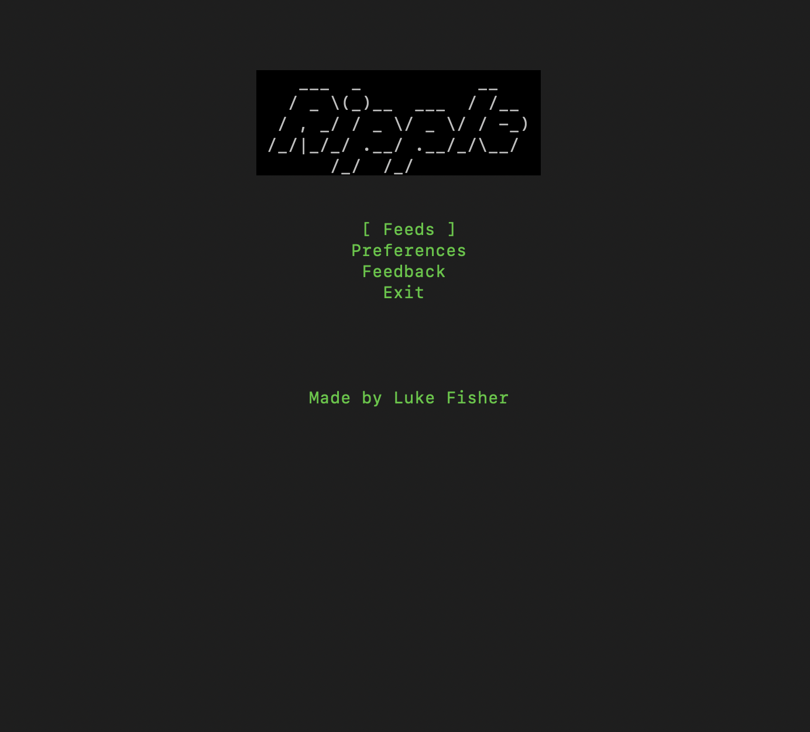
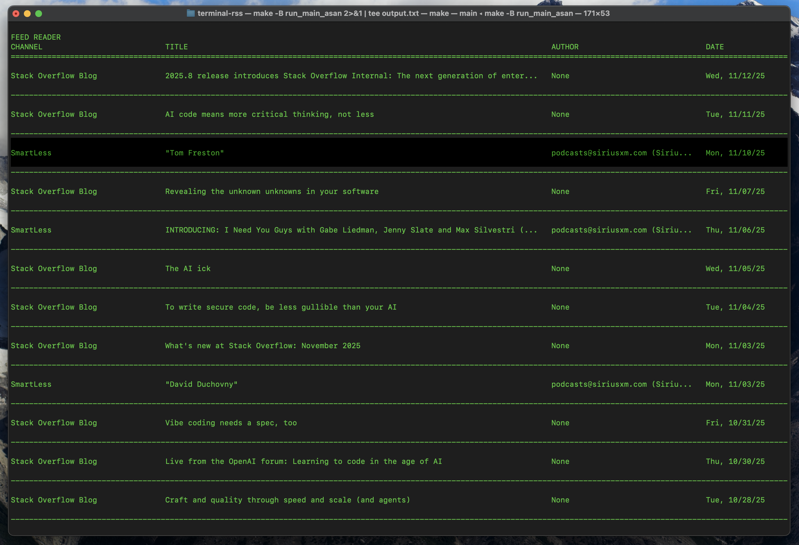
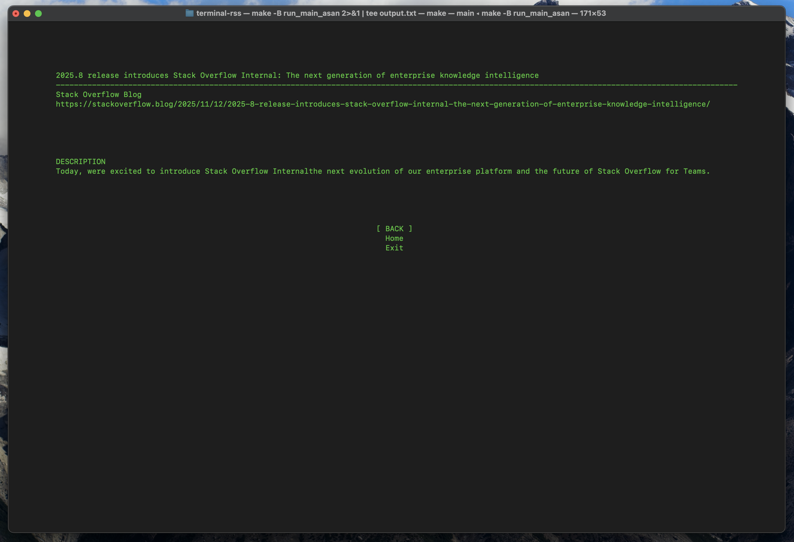

# Terminal RSS Aggregator
A lightweight RSS Aggregator that runs in your terminal. Written in C. Custom text UI that will periodically fetch feeds and cache them for you. (Caching to be implemented and networking to be sorted out)

### Main Menu

### Feed Reader

### Article Page

See todo.txt for what's next