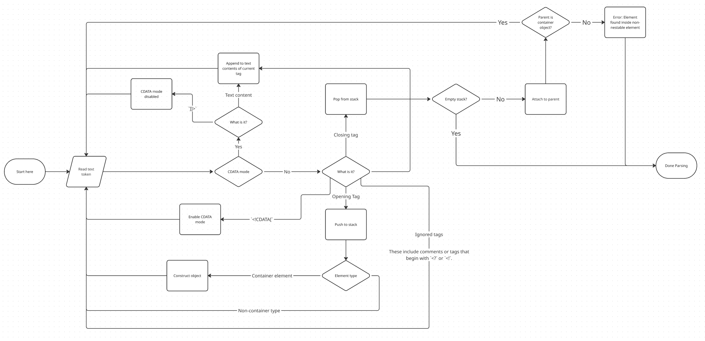
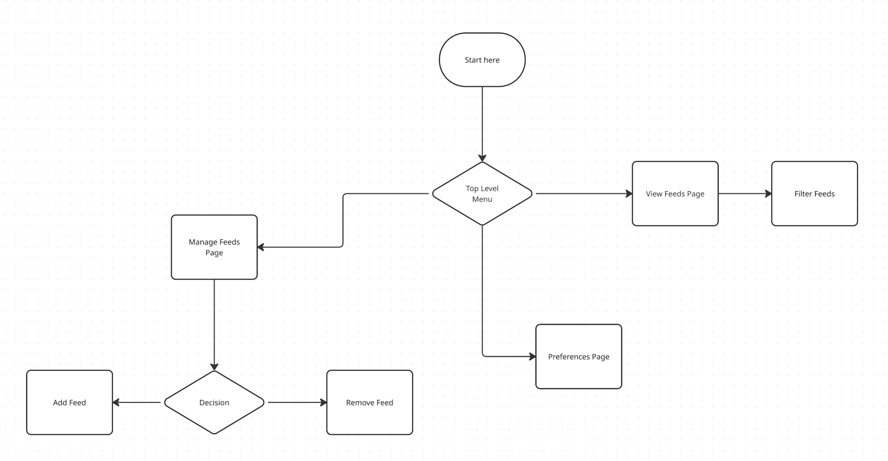

# Architecture
This document outlines the requirements and overall architecture of this design.

## Problem Statement
This statement summarizes what problem we're fixing. It's addressed from the user side.

*The user has no way of subscribing, storing, and browsing RSS Feeds. More specifically, the user cannot subscribe to a feed and store that information somewhere. Then the subscribed feeds don't get refreshed so the user needs to go back to each feed and re-view the feed XML. Then finally, there is no aggregation of the various feeds they're subscribed to. Therefore, they must spend an inordinate amount of time looking at each feed*

## Requirements
The requirements are constantly revolving as the project grows. But here's the minimum requirements.

##### Must be able to save a list of subscribed RSS feeds
The user will save feeds and we'll need to access that list in order to update and display feed updates. This should probably be a text file for now. Could potentially be scaled to be a DB, but considering this is written in C, I don't see an need for that.

##### A mechanism for storing / subscribing to new feeds
The user must be able to add to our database of subscribed RSS feeds.

##### Must use HTTP/S to fetch RSS feed XML docs
The fetch frequency will most likely be twice a day. There will also be an option to manually trigger a refresh. There should be a cool down of about 10 minutes though to ensure we're not abusing servers.

##### Provide a basic TUI / CLI for interacting / browsing articles from the feeds
Options to filter out certain feeds is important.

## Architecture
#### Assumptions
- There is only a single `channel` element in each RSS feed.
- `item` tags will all exist at the same height.
- XML attributes don't matter.
- We don't support namespaces and RSS extensions.
- We only adhere to the RSS 2.0 standard.
- Certain elements such as `title` or `description` tags will have no children.

#### XML Parser Flowchart
Parse an RSS XML Document into something readable / presentable to the user. This a streaming parser, so it avoids building a DOM we have to traverse twice (Once to build the tree and then again to build objects for each feed/article).

There are basically 3 things inside an RSS XML document that we care about:
- Opening tags
- Closing tags
- Text content between tags

We don't care about the attributes in the XML tags. All of the required data is encoded in the tag names and the text between the tags.

This solution will essentially keep a stack. The stack will be of C strings which will be the names of tags. Some elements are "containers", some are not. For example, _channel_ and _item_ elements are containers. They can hold other elements. _title_ and _description_ tags are not containers, they should have no child elements.

#### UI Menu Layout

## Appendix A - List of all RSS XML tags
Below is a list of all the RSS XML tags. Pulled from [here](https://www.rssboard.org/rss-draft-1#elements)

- rss
- channel
    - description
    - link
    - title
    - category
    - cloud
    - copyright
    - docs
    - generator
    - image
        - link
        - title
        - url
        - description
        - height
        - width
    - language
    - lastBuildDate
    - managingEditor
    - pubDate
    - rating
    - skipDays
        - day
    - skipHours
        - hour
    - textInput
        - description
        - link
        - name
        - title
    - ttl
    - webMaster
    - item
        - author
        - category
        - comments
        - description
        - enclosure
        - guid
        - link
        - pubDate
        - source
        - title

